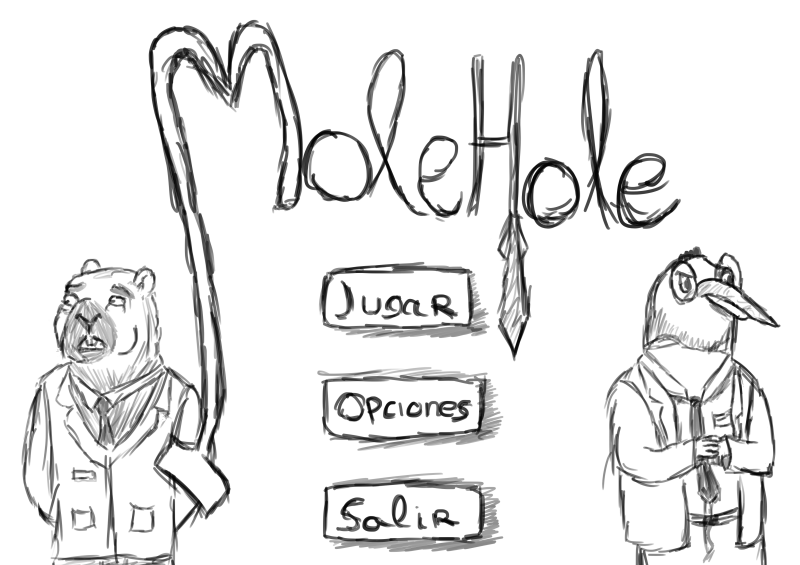
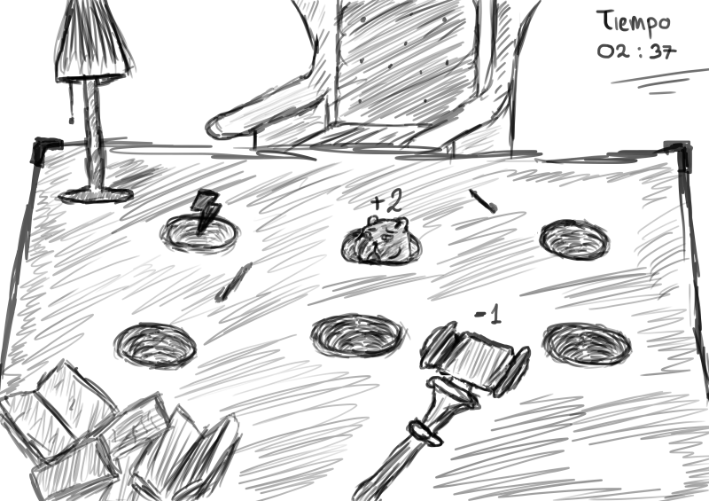
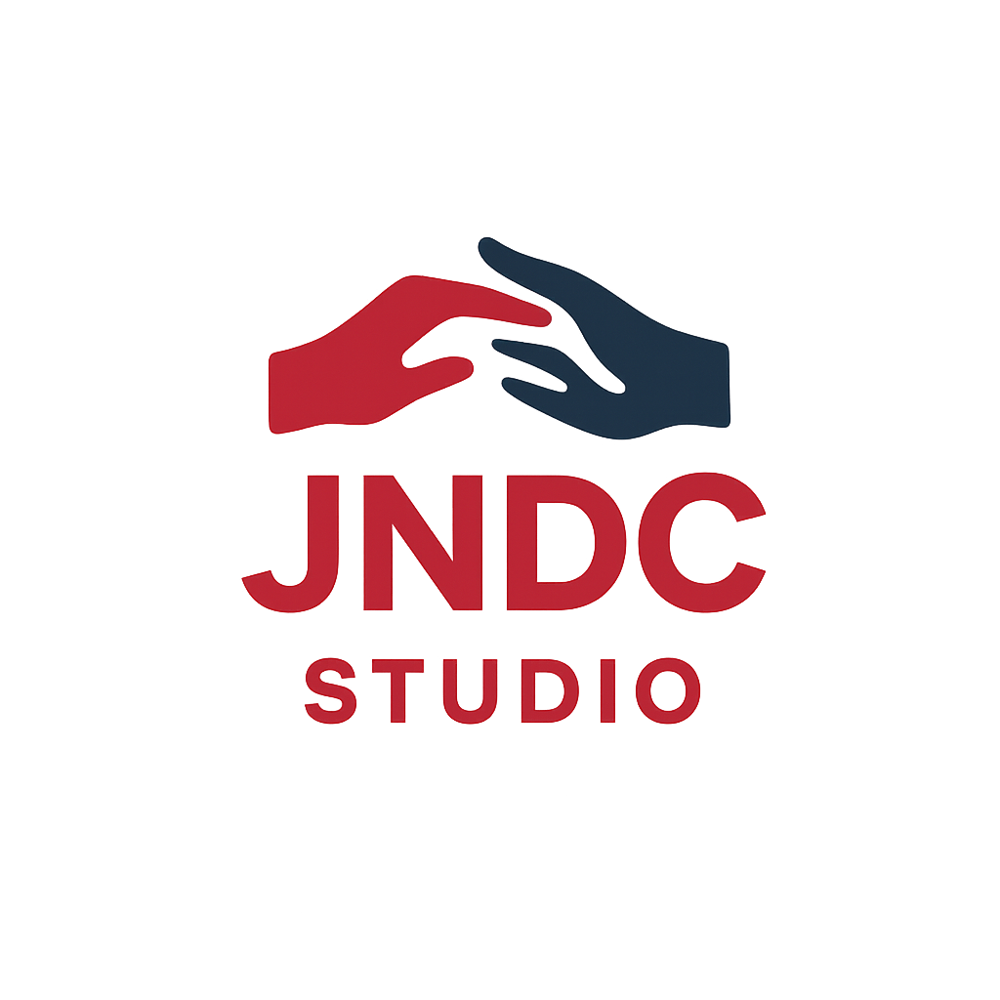
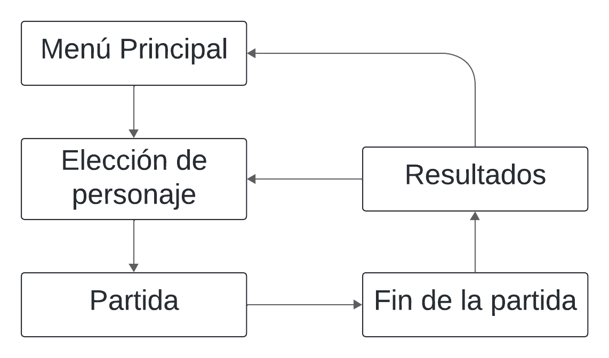

# 🎮 Game Design Document (GDD) – *MoleHole*

## 1. Información General
- **Nombre del juego:** MoleHole
- **Género:** Party / Arcade Competitivo
- **Plataforma:** PC  
- **Modo:** Multijugador en red  
- **Público objetivo:** Todas las edades 
- **Estilo visual:** Cartoon
- **Inspiración:** Los juegos arcade clásicos de las ferias, Whac-A-Mole, It Takes Two
- **Duración promedio de partida:** 3 minutos
- **Número de jugadores:** 2 por partida
- **Repositorio de Github:** https://github.com/1Nash0/JuegosEnRed.git

---

## 2. Concepto del Juego
* MoleHole es un juego competitivo por rondas en el que dos jugadores asumen roles opuestos:
  - *Jugador 1:* el mazo, que debe golpear al topo que aparece en diferentes agujeros.
  - *Jugador 2:* el topo, que debe engañar y esquivar al mazo, apareciendo en lugares estratégicos y usando power-ups para sumar puntos.
* El objetivo es acumular más puntos que el oponente antes de que el tiempo termine.
---

## 3. Mecánicas de Juego
- El jugador que controla el mazo se moverá usando el ratón y el click izquierdo para golpear, mientras que el topo usará las teclas numéricas para aparecer por los diferentes agujeros.
- Si el jugador que controla el mazo logra golpear al topo gana puntos y el topo pierde, pero por cada error del mazo el topo es el que gana puntos y el mazo pierde.
- El juego contará con una serie de power-ups disponibles para cada jugador y que se pueden usar pulsando el click derecho para el mazo o la barra espaciadora para el topo. Estos power-ups no pueden acumularse, por lo que deberán ser usados antes de poder coger el siguiente. Su recolección consta de que aparezcan en algún agujero de manera aleatoria y oculta hasta que se consiga. Entre los power-ups se encuentran:
  - Trampa: como su nombre indica es una trampa del topo que se coloca de manera secreta en uno o más agujeros y si el mazo golpea uno de estos perderá el doble de puntos y el topo ganará el doble. Si el topo decide salir por el agujero en el que se encuentra la trampa y el mazo lo golpea, este último perderá 1 punto mientras que el topo ganaría 1 punto.
  - Bloqueo: el topo bloquea todos los agujeros durante un breve periodo de tiempo ganando puntos con el tiempo e impidiendo que el mazo golpee.
  - Golpetazo: el mazo abre todos los agujeros durante un breve periodo de tiempo y puede golpear cualquier agujero para ganar puntos, este power-up no provoca que el topo pierda puntos. Si este Power Up es usado después de bloqueo, tendrá prioridad, si es usado mientras aún haya trampas en los agujeros, las elimina por completo.
  - Mejora: el mazo obtiene un aumento durante un período de tiempo que le permite golpear más fuerte obteniendo el doble de puntos y provocando que el topo pierda el doble. Si el mazo golpea una trampa mientras el efecto está activo, ninguno de los bandos pierde o gana puntos.
  - Tiempo extra: Power-up pudiendo ser agarrado por el mazo o el topo que aumenta el tiempo en 30 segundos por cada uso, hasta un máximo de 1:30, es decir, sólo puede ser usado 3 veces, a partir de ese momento dejará de aparecer.
- El juego contará con un reloj, en alguna zona de la pantalla que no moleste, que medirá en tiempo restante, una vez se termine el tiempo, el jugador con más puntos ganará la partida y se deberá iniciar otra partida para seguir jugando.

---

## 4. Controles

| Acción   Pin          | Tecla / Botón               |
|-----------------------|-----------------------------|
| Aparecer              | Teclas numéricas            |
| Coger Power-Up        | Barra espaciadora / Click   |

| Acción   Pom          | Tecla / Botón               |
|-----------------------|-----------------------------|
| Moverse               | Movimiento del ratón        |
| Coger Power-Up        | Click derecho               |
| Golpear               | Click izquierdo             |

---

## 5. Físicas y Escenario
- **Mapa:** cuadrado 2D con 9 agujeros distribuidos en una cuadrícula 3x3 . 
- **Movimiento:**
  - Mazo se desplaza con suavidad (inercia ligera).
  - El topo aparece instantáneamente al pulsar una tecla numérica.
- **Dificultad progresiva:** a medida que avanza el tiempo, la velocidad de aparición del topo aumenta, reduciendo la ventana de reacción del mazo.  
- **Física del mazo:** si el jugador hace click muy rápido, se aplicará un pequeño “delay” para evitar spam de golpes.  
- **Colisiones:** simples, detección de impacto al hacer clic en el agujero activo. 
- **Spawn de power-ups:** aleatorio, con sistema de control para evitar repeticiones consecutivas.
- **UI:**
  - Reloj visible en la parte superior central.
  - Marcadores de puntos a izquierda y derecha.
  - Barra de estado para power-ups y cooldown.

---

## 6. Arte y Diseño Visual
- **Estilo:** Cartoon 
- **Cámara:** Top–down.  
- **Animaciones:**
  - Topo saliendo del agujero
  - Golpe de mazo con efecto de impacto exagerado
  - Power-up recogido
- **Inspiración artística:** estética cartoon inspirada en los juegos de feria de los 80, la interfaz simple y colorida de *Animal Crossing*, y la exageración en animaciones de *Cuphead*. Además de los personajes inspirados en el universo de *Bojack Horseman*.
- **Uso del color:** la paleta de colores vivos busca transmitir alegría, dinamismo y accesibilidad para todas las edades. Los contrastes fuertes ayudan a que los agujeros y personajes sean fácilmente distinguibles durante partidas rápidas.
- **Bocetos:**
  
  - Pantalla de inicio              
 

  - Personajes principales               
 

  - Escenario base con los agujeros
 
 
- **Logo:**

---

## 7. Sonido
- **Música:** BGM espacial retro estilo arcade.  
- **Efectos sonoros:**
  - Golpe de mazo → “Smash” con eco suave estilo arcade.
  - Topo apareciendo → “Pop” corto y agudo.
  - Power-up recogido → campanilla brillante.
  - Cuenta regresiva → pitido acelerado.

---

## 8. Narrativa
- Erase una vez dos grandes amigos, Pin y Pom. Ambos crecieron juntos, con el mismo sueño, hacer que los malhechores estuviesen entre rejas, esto es debido a un recuerdo traumático de ambos, la muerte de otro gran amigo suyo a manos de un delincuente. Los dos crecieron apoyándose el uno al otro, tanto en los estudios como en otros temas. Al llegar a la universidad consiguieron su título y por fin llegaron a ser abogados. Su fama como pareja de abogados crecía como la espuma puesto que cuando estaban juntos no había ningún caso que se les resistiera. Sin embargo, el destino decidió jugársela poniéndolos en contra en un caso que llevaría a su separación. Pom acabó ganando a través de malas prácticas y Pin quedó solo. Con el tiempo, empezaron a distanciarse más todavía, Pom aumentaba su fama, pero Pin intentaba sacar a la luz sus trapos sucios. Al final, Pom acabó convirtiéndose en juez y en su primer caso, encontró a Pin y decidió, a partir de ese momento, hacerle la vida imposible. Historia completa en el anexo.
- **Personajes:**  
  - **Pin:** (Topo) Motivado por la justicia, busca burlar a Pom como forma simbólica de redimirse y seguir luchando contra la corrupción.
  - **Pom:** (Juez pingüino) Quiere demostrar su supremacía y control absoluto, reflejado en su rol ofensivo como mazo.

---

## 9. Diagrama de Flujo

## 10. Estrategia de Marketing
- **Público objetivo:** jugadores casuales que buscan partidas rápidas y competitivas.
- **Canales de difusión:** redes sociales (TikTok, Instagram), anuncios en páginas web.
- **Promoción:** trailers cortos mostrando partidas de 30 segundos con humor.
- **Eventos:** torneos online semanales y minijuegos diarios para mantener comunidad activa.

## 11. Anexo
-**Historia completa del juego:**
Años 90, Animatopia, una ciudad que, pese a su nombre, está plagada de delincuentes y gente sin honor. La ley no se hace respetar, los abogados se convirtieron en títeres de sus clientes y los jueces apenas tienen poder para condenar. En esta ciudad nacen nuestros protagonistas Pin y Pom y su gran amigo Pum, unos años mayor que ellos. Sus familias se hicieron amigos y, por ende, ellos también. Los tres crecieron en un barrio no muy peligroso, jugaban juntos, reían y se divertían, quien diría que la tragedia estaba por llegar. Un día, cuando los tres estaban comprando en una tienda un encapuchado entró y a punta de pistola amenazó al trabajador y le obligó a poner todo el dinero en una mochila. Cuando acabó, el delincuente, no contento con lo que había sacado vio al trío y se acercó a ellos para robarles, Pin y Pom accedieron a darle lo que tenían por miedo, pero Pum no, estaba harto, había visto más robos de los que podía aguantar y en lugar de aceptar y callar intentó abalanzarse sobre el delincuente, ambos cayeron al suelo y comenzó el forcejeo, el trabajador llamó a la policía y Pin y Pom quedaron helados, incapaces de moverse, de repente, un disparo, Pum dejó de moverse y el delincuente movió su cuerpo dejando ver un agujero de bala en el pecho de Pum. La policía llegó minutos después, pero era muy tarde, el delincuente escapó y Pum yacía muerto en el suelo rodeado de un charco de sangre. El trauma jamás abandonaría a nuestros amigos. La noticia se hizo eco y en el funeral, Pin y Pom hicieron una promesa, encontrar al delincuente y meterle en la cárcel. La familia de Pum se mudó, incapaz de vivir en la ciudad que se había cobrado la vida de su único hijo y así el tiempo pasó. Pin y Pom reforzaron su amistad ayudándose el uno al otro, tanto en el instituto como en la universidad. Y, por fin, tras muchos años, consiguieron su título de abogado. Abrieron su propio despacho donde comenzaron sus andanzas. Empezando por casos pequeños y tras volverse más y más famosos, pasaron a casos más grandes. Juntos eran completamente invencibles en un juicio. Mientras tanto, ambos buscaban al responsable de su trauma y tras años de búsqueda lo hallaron, un juicio por robo a mano armada y aceptaron ser los abogados de la víctima a precio reducido. En el juicio lo hundieron en el más profundo abismo, tal era su sentencia que es mejor no decirla. Sin embargo, Pom no se sentía realizado, él quería que todos pagaran y fue a por su familia, Pin se interpuso afirmando que ellos no tenían nada que ver, su debate se agitó y provocó la primera de muchas rencillas entre ambos. En el juicio contra la familia, Pom usó tácticas sucias usando la manipulación para hacer creer que Pin defendía a delincuentes no por dinero ni obligación sino porque favorecía al sistema corrupto. Desgraciadamente esa manipulación resultó efectiva, Pin perdió el juicio y su credibilidad mientras que Pom ahora ansiaba más. Pin se prometió destapar a Pom y nuestros amigos se volvieron enemigos. Pom conseguía mejores casos y sus tácticas iban empeorando cada vez más, por su parte Pim intentaba desenmascarar, pero sus reputaciones y famas opuestas, así como el conocimiento de Pom hacían la tarea imposible. El punto de inicio del fin llegó cuando en un juicio en el que Pin participaba, Pom también, no como abogado, sino como juez, no habiendo olvidado los múltiples intentos de Pin de llevarlo a la ruina ya la cárcel, Pom decidió en ese momento volverse el juez personal de Pim y convertir su vida y sus intentos de sacar todo a la luz en polvo.

