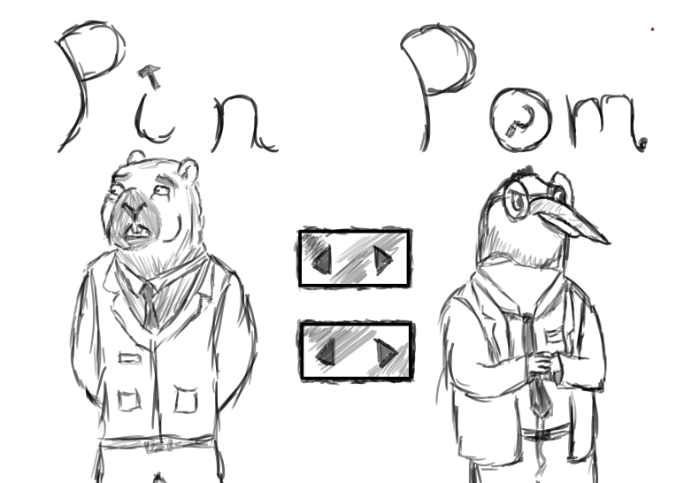

# 🎮 Game Design Document (GDD) – *MoleHole*

## 1. Información General
- **Nombre del juego:** MoleHole
- **Género:** Party / Arcade Competitivo
- **Plataforma:** PC  
- **Modo:** Multijugador en red  
- **Público objetivo:** Todas las edades 
- **Estilo visual:** Cartoon
- **Inspiración:** Los juegos arcade clásicos de las ferias

---

## 2. Concepto del Juego
* El juego trata de golpear a un topo que sale por distintos agujeros, consiguiendo puntos y power-ups, tanto por el lado del martillo como por el lado del topo.

---

## 3. Mecánicas de Juego
- El jugador que controla el mazo se moverá usando el ratón y el click izquierdo para golpear, mientras que el topo usará las teclas numéricas para aparecer por los diferentes agujeros.
- Si el jugador que controla el mazo logra golpear al topo gana puntos y el topo pierde, pero por cada error del mazo el topo es el que gana puntos y el mazo pierde.
- El juego contará con una serie de power-ups disponibles para cada jugador y que se pueden usar pulsando el click derecho para el mazo o la barra espaciadora para el topo. Estos power-ups no pueden acumularse, por lo que deberán ser usados antes de poder coger el siguiente. Su recolección consta de que aparezcan en algún agujero de manera aleatoria y oculta hasta que se consiga. Entre los power-ups se encuentran:
  - Trampa: como su nombre indica es una trampa del topo que se coloca de manera secreta en uno o más agujeros y si el mazo golpea uno de estos perderá el doble de puntos y el topo ganará el doble.
  - Bloqueo: el topo bloquea todos los agujeros durante un breve periodo de tiempo ganando puntos con el tiempo e impidiendo que el mazo golpee.
  - Golpetazo: el mazo abre todos los agujeros durante un breve periodo de tiempo y puede golpear cualquier agujero para ganar puntos, este power-up no provoca que el topo pierda puntos.
  - Mejora: el mazo obtiene un aumento que le permite golpear más fuerte obteniendo el doble de puntos y provocando que el topo pierda el doble.
- El juego contará con un reloj, en alguna zona de la pantalla que no moleste, que medirá en tiempo restante, una vez se termine el tiempo, el jugador con más puntos ganará la partida y se deberá iniciar otra partida para seguir jugando. 

---

## 4. Controles

| Acción   Pin          | Tecla / Botón               |
|-----------------------|-----------------------------|
| Aparecer              | Teclas numéricas            |
| Coger Power-Up        | Barra espaciadora / Click   |


| Acción   Pom          | Tecla / Botón               |
|-----------------------|-----------------------------|
| Moverse               | Movimiento del ratón        |
| Coger Power-Up        | Click derecho               |
| Golpear               | Click izquierdo             |


---

## 5. Físicas y Escenario
- Mapa cuadrado 2D.  
- Movimiento fluido con inercia ligera.  
- Colisiones simples entre lois jugadores. 
- Power-ups aparecen aleatoriamente.

---

## 6. Arte y Diseño Visual
- **Estilo:** Cartoon 
- **Cámara:** Top–down.  
- **Colores:** Paleta de colores vivos.  
- **Bocetos:** 
   
- **Logo:** (Puedes incluirlo más adelante).

---

## 7. Sonido
- **Música:** BGM espacial retro estilo arcade.  
- **Efectos:** Disparos, explosiones, colisiones, aparición de power-ups.

---

## 8. Narrativa
- Erase una vez dos grandes amigos, Pin y Pom. Ambos crecieron juntos, con el mismo sueño, hacer que los malhechores estuviesen entre rejas, esto es debido a un recuerdo traumático de ambos, la muerte de otro gran amigo suyo a manos de un delincuente. Los dos crecieron apoyándose el uno al otro, tanto en los estudios como en otros temas. Al llegar a la universidad consiguieron su título y por fin llegaron a ser abogados. Su fama como pareja de abogados crecía como la espuma puesto que cuando estaban juntos no había ningún caso que se les resistiera. Sin embargo, el destino decidió jugársela poniéndolos en contra en un caso que llevaría a su separación. Pom acabó ganando a través de malas prácticas y Pin quedó solo. Con el tiempo, empezaron a distanciarse más todavía, Pom aumentaba su fama, pero Pin intentaba sacar a la luz sus trapos sucios. Al final, Pom acabó convirtiéndose en juez y en su primer caso, encontró a Pin y decidió, a partir de ese momento, hacerle la vida imposible.
- **Personajes:**  
  - *Pom* – Juez Pingüino
  - *Pin* – Abogado Topo

---

## 9. Diagrama de Flujo
```text
Menú principal → Lobby multijugador → Partida en red
      ↑                                 ↓
   Resultados ← Fin de partida ← Jugadores
